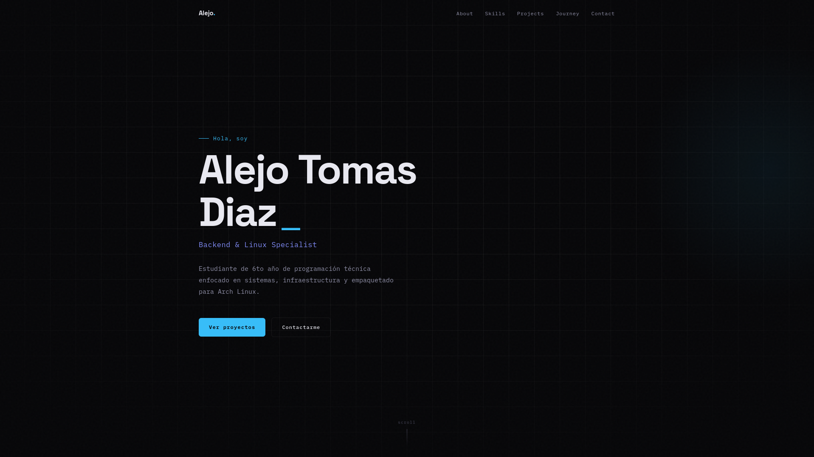

# 🚀 Portfolio Personal - Alejo Tomas Diaz



Este es el repositorio de mi portfolio personal, donde muestro mis proyectos, habilidades y trayectoria

## 🛠️ Tecnologías Utilizadas

- **HTML5** & **CSS3**
- **JavaScript Moderno**
- **SEO Optimized**
- **Responsive Design**

## 📂 Estructura del Proyecto

```text
.
├── assets/             # Recursos estáticos (imágenes, favicons, PDF)
│   ├── projects/       # Capturas de pantalla de los proyectos
│   └── favicon_io/     # Archivos de íconos para el navegador
├── css/                # Estilos (CSS modular)
├── js/                 # Lógica e interactividad
├── index.html          # Punto de entrada principal
└── robots.txt          # Configuración para motores de búsqueda
```

## 🐧 Sobre Mí

Soy estudiante de 6to año de programación técnica en la EPET 20 de Neuquén. Me apasiona el mantenimiento de infraestructura, la administración de **HomeLabs** y el empaquetado para **Arch Linux (AUR)**.

## 📧 Contacto

- **LinkedIn**: [alejo-diaz](https://linkedin.com/in/alejo-diaz)
- **Email**: [alejopek62@gmail.com](mailto:alejopek62@gmail.com)
- **AUR Packages**: [sys-dashboard](https://aur.archlinux.org/packages/sys-dashboard)

---

Hecho con ❤️ por Alejo Tomas Diaz
